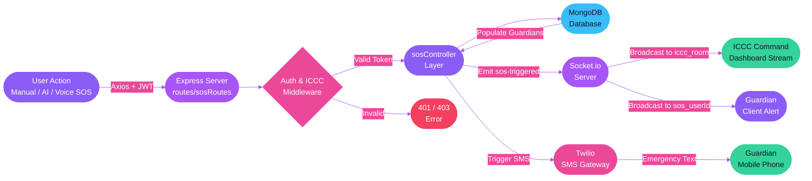

<div align="center">


<br>

[](https://github.com/Akash-Hedaoo/WOMEN-SAFETY-APPLICATION)

</div>


<br>

<div align="center">

## Quick Links

| Resource | Platform | Link |
|:--------:|:--------:|:-----|
| Local App | Frontend | http://localhost:5173 |
| Backend API | Express Server | http://localhost:5001 |
| ICCC Control Room | Command Center | http://localhost:5173/iccc `(Passcode: COMMAND112)` |
| GitHub Repository | GitHub | https://github.com/Akash-Hedaoo/WOMEN-SAFETY-APPLICATION |

</div>

<br>


<br>

<div align="center">

## Project Description

</div>

Safe-Era is a full-stack, next-generation women's safety platform built specifically for India. It bridges the critical gap between citizens, trusted guardians, and emergency command authorities. It integrates multi-signal **AI Threat Detection** (Motion, Audio, GPS deviation), **Voice-Triggered Hands-Free SOS**, a **Live Interactive Safety Map**, a **Guardian Network**, and an **ICCC (Integrated Command & Control Center) Dashboard** for real-time authority response into a single application.

<br>


<br>

<div align="center">

## Problem Statement

</div>

```
  x  No single app combines safety map, SOS, AI risk monitoring, and command center together
  x  Standard safety apps require manual physical touch — useless when restrained or in panic
  x  No background risk monitor watching for violent jolts, screams, or route detours
  x  Authorities and police have no real-time bird's-eye command dashboard to track incidents
  x  No offline or low-connectivity fallback mechanism for SMS alert delivery

  +  Safe-Era consolidates multi-mode SOS — manual tap, hands-free voice, and AI auto-escalation
  +  AI Threat Detection constantly measures motion, audio distress dB, and GPS deviations
  +  Voice SOS listens hands-free for distress phrases with a 3-second cancel countdown
  +  ICCC Command Dashboard allows authority operators to view bird's-eye map & dispatch units
  +  Twilio SMS fallback ensures guardians get notified even without internet app connectivity
```

<br>

<div align="center">

<table>
<tr>
<td align="center" width="50%">

### Every Other Safety App


</td>
<td align="center" width="50%">

### Safe-Era


</td>
</tr>
</table>

</div>

<br>


<br>

<div align="center">

## Feature Showcase

<table>
<tr>
<td align="center" width="25%">


**AI Threat Detection**

Background monitor measuring phone Accelerometer (Motion jolts), Audio distress dB, and GPS route deviation into a 0–100 Threat Score with soft check-ins and auto-SOS.


</td>
<td align="center" width="25%">


**Voice-Triggered SOS**

Hands-free Web Speech API phrase listener matching distress phrases (*"help me now"*, *"I am not safe"*). Displays a 3-second cancel countdown overlay.


</td>
<td align="center" width="25%">


**ICCC Command Dashboard**

Integrated Command & Control Center for authority operators. Live bird's-eye incident map, Socket.io stream, and 1-tap dispatch actions (*"Mark Responding"*, *"Mark Resolved"*).


</td>
<td align="center" width="25%">


**One-Press SOS**

Single tap manual trigger instantly alerts all guardians with live GPS location, Google Maps link, and automated Twilio SMS backup messages.


</td>
</tr>
<tr>
<td align="center" width="25%">


**Live Safety Map**

Interactive Leaflet map displaying police stations, hospitals, and community-verified safe zones across Indian cities.


</td>
<td align="center" width="25%">


**Guardian Network**

Add trusted contacts as emergency guardians with custom relationship labels. They receive real-time Socket.io SOS alerts and SMS notifications.


</td>
<td align="center" width="25%">


**Wellness & Legal Guides**

Curated women's wellness guides, self-defense articles, and legal current affairs updates tailored for daily awareness.


</td>
<td align="center" width="25%">


**Secure Auth & Subscriptions**

JWT-based registration and login. Subscription plans processed via Razorpay — UPI, card, net banking, and wallet supported.


</td>
</tr>
</table>

</div>

<br>


<br>

<div align="center">

## Subscription Plans

</div>

```
Safe-Era offers three plans — Basic stays free forever. Upgrade only when you need more.

  BASIC HAVEN       ->  Rs. 0 / month — Free forever
                        Interactive Safety Map access
                        Basic Guardian Log (up to 2 contacts)
                        Standard Manual SOS Alerts
                        Community Wellness & News Guides

  PREMIUM GUARDIAN  ->  Rs. 199 / month
                        Everything in Basic Haven
                        AI Threat Detection Engine (0-100 Score)
                        Voice-Triggered Hands-Free SOS
                        Unlimited Guardian Circle Groups
                        Priority Twilio SMS Backup

  ANNUAL SANCTUARY  ->  Rs. 1990 / year  (2 months free — saves Rs. 398)
                        All Premium Guardian Features
                        ICCC Command Center Access
                        2 Months Free Included
                        Exclusive Annual Safety Workshops
```

<br>


<br>

<div align="center">

## Tech Stack

### Frontend


<br><br>

<table>
<tr>
<th align="center">Layer</th>
<th align="center">Technology</th>
<th align="left">What it does in Safe-Era</th>
</tr>
<tr>
<td align="center"></td>
<td align="center"><strong>React 18 + Vite</strong></td>
<td>Fast HMR single page app. All safety screens — map, SOS, dashboard, guardian network, ICCC — built as isolated React components.</td>
</tr>
<tr>
<td align="center"></td>
<td align="center"><strong>React Router DOM v6</strong></td>
<td>Protected routes for all dashboard screens. Public routes for landing, login, and signup. Role-based routing for free vs premium features.</td>
</tr>
<tr>
<td align="center"></td>
<td align="center"><strong>Tailwind CSS v3</strong></td>
<td>Glassmorphic dark design system with vibrant neon purple, magenta, and cyan tokens. High-contrast custom dropdown controls.</td>
</tr>
<tr>
<td align="center"></td>
<td align="center"><strong>Socket.io Client</strong></td>
<td>Receives real-time location updates and emits SOS events to guardian rooms (`sos_${userId}`) and command rooms (`iccc_room`).</td>
</tr>
<tr>
<td align="center"></td>
<td align="center"><strong>Web Speech API</strong></td>
<td>Continuous hands-free speech recognition matching distress phrases (*"help me now"*, *"I am not safe"*) with 3s cancel countdown overlay.</td>
</tr>
<tr>
<td align="center"></td>
<td align="center"><strong>Leaflet + OpenStreetMap</strong></td>
<td>Renders the interactive safety map with custom illustrated pin markers for police, hospitals, safe zones, and live SOS incidents.</td>
</tr>
</table>

<br>

### Backend


<br><br>

<table>
<tr>
<th align="center">Layer</th>
<th align="center">Technology</th>
<th align="left">What it does in Safe-Era</th>
</tr>
<tr>
<td align="center"></td>
<td align="center"><strong>Node.js + Express</strong></td>
<td>REST API server with modular route structure. Handles all auth, guardian, SOS, location, and subscription routes with global error middleware.</td>
</tr>
<tr>
<td align="center"></td>
<td align="center"><strong>Socket.io Server</strong></td>
<td>Manages real-time location broadcasting to guardian rooms. Fires SOS events to all connected guardian clients and ICCC operators instantly on trigger.</td>
</tr>
<tr>
<td align="center"></td>
<td align="center"><strong>MongoDB + Mongoose</strong></td>
<td>Stores users, guardian relationships, SOS alert history, location logs, safe places, and typed threat metrics schemas.</td>
</tr>
<tr>
<td align="center"></td>
<td align="center"><strong>JSON Web Tokens</strong></td>
<td>Stateless authentication on all protected routes. Token verified by custom authMiddleware and icccAuthMiddleware.</td>
</tr>
<tr>
<td align="center"></td>
<td align="center"><strong>Twilio SDK</strong></td>
<td>Sends SMS alerts to guardian phone numbers when SOS is triggered — ensures delivery even if the guardian does not have the app open.</td>
</tr>
</table>

</div>

<br>


<br>

<div align="center">

## Data Flow Architecture



<br>


</div>

<br>


<br>

<div align="center">

## Folder Structure

</div>

```
WOMEN-SAFETY-APPLICATION/
|
+-- backend/
|   +-- src/
|   |   +-- config/
|   |   |   +-- db.js                     <- MongoDB Atlas connection with fallback handling
|   |   |   +-- socket.js                 <- Socket.io server initialization and room management
|   |   |
|   |   +-- controllers/
|   |   |   +-- authController.js         <- Register | Login | Get Profile | Refresh Token
|   |   |   +-- guardianController.js     <- Add | Remove | List Guardians
|   |   |   +-- sosController.js          <- Trigger SOS | Deduplication Guard | ICCC Controllers
|   |   |   +-- locationController.js     <- Live location sharing sessions
|   |   |   +-- mapController.js          <- Nearby Safe Places | POIs
|   |   |   +-- subscriptionController.js <- Create Order | Verify Payment | Activate Plan
|   |   |
|   |   +-- middleware/
|   |   |   +-- authMiddleware.js         <- JWT decode and user injection
|   |   |   +-- icccAuthMiddleware.js     <- Passcode and allowlist check for command operators
|   |   |   +-- errorMiddleware.js        <- Global error formatting
|   |   |
|   |   +-- models/
|   |   |   +-- User.js                   <- User schema
|   |   |   +-- Guardian.js               <- Guardian relationship schema
|   |   |   +-- SosAlert.js               <- triggerSource | threatScore | threatDetails | icccStatus schema
|   |   |   +-- SafePlace.js              <- Safe zones schema
|   |   |   +-- Subscription.js           <- Payment & plan schema
|   |   |
|   |   +-- routes/
|   |   |   +-- authRoutes.js
|   |   |   +-- guardianRoutes.js
|   |   |   +-- sosRoutes.js              <- /trigger | /iccc/incidents | /iccc/incidents/:id/status
|   |   |   +-- locationRoutes.js
|   |   |   +-- mapRoutes.js
|   |   |   +-- subscriptionRoutes.js
|   |   |   +-- index.js                  <- Mounts all route modules at /api
|   |   |
|   |   +-- server.js                     <- Express + Socket.io bootstrap + MongoDB connect
|   |
|   +-- .env
|   +-- package.json
|
+-- frontend/
|   +-- src/
|   |   +-- components/
|   |   |   +-- Layout/
|   |   |   |   +-- Navbar.jsx            <- Top navigation header with ICCC Command link
|   |   |   |   +-- MobileBottomNav.jsx
|   |   |   +-- Safety/
|   |   |   |   +-- AIThreatMonitor.jsx   <- Multi-signal AI threat score gauge & check-in modal
|   |   |   |   +-- VoiceSOSListener.jsx  <- Web Speech API phrase listener & 3s countdown
|   |   |   +-- Map/
|   |   |   |   +-- MapContainer.jsx      <- Leaflet map container with custom POI & incident pins
|   |   |   +-- SignupStep1.jsx
|   |   |   +-- SignupStep2.jsx           <- Relationship dropdown with high-contrast styling
|   |   |
|   |   +-- pages/
|   |   |   +-- Dashboard.jsx
|   |   |   +-- SOS.jsx                   <- Multi-mode SOS workspace (Manual, AI Threat, Voice)
|   |   |   +-- ICCCDashboard.jsx         <- Control room operator dashboard with 1-tap action buttons
|   |   |   +-- Map.jsx
|   |   |   +-- GuardianNetworkPage.jsx
|   |   |   +-- WellnessPage.jsx
|   |   |   +-- CurrentAffairsPage.jsx
|   |   |   +-- SettingsPage.jsx
|   |   |
|   |   +-- router/
|   |   |   +-- Router.jsx                <- React Router DOM route definitions including /iccc
|   |   |
|   |   +-- utils/
|   |   |   +-- constants.js              <- API_BASE_URL and ROUTES definitions
|   |   |
|   |   +-- App.jsx
|   |   +-- main.jsx
|   |   +-- index.css                     <- Premium dark mode styles & .premium-select contrast rules
|   |
|   +-- vite.config.js
|   +-- package.json
```

<br>


<br>

<div align="center">

## Getting Started

<table>
<tr>
<td>

```
+==================================================================+
|                                                                  |
|   +----------------------------------------------------------+   |
|   |  TERMINAL                                          . . . |   |
|   +----------------------------------------------------------+   |
|   |                                                          |   |
|   |  $ git clone github.com/Akash-Hedaoo/WOMEN-SAFETY-APP    |   |
|   |  Cloning into 'WOMEN-SAFETY-APPLICATION'... done.        |   |
|   |                                                          |   |
|   |  $ cd backend && npm install                             |   |
|   |  added 210 packages in 7s                                |   |
|   |                                                          |   |
|   |  $ cp .env.example .env                                  |   |
|   |  # paste MONGO_URI, JWT_SECRET, ICCC_PASSCODE            |   |
|   |                                                          |   |
|   |  $ npm start                                             |   |
|   |  + MongoDB connected                                     |   |
|   |  + Socket.io initialized                                 |   |
|   |  + Server running at http://localhost:5001               |   |
|   |                                                          |   |
|   |  $ cd ../frontend && npm install && npm run dev          |   |
|   |  + Frontend running at http://localhost:5173             |   |
|   |                                                          |   |
|   |  Safe-Era is live. Travel without fear.                  |   |
|   |                                                          |   |
|   +----------------------------------------------------------+   |
|                                                                  |
+==================================================================+
```

</td>
</tr>
</table>

</div>

### Prerequisites


### 1 — Clone

```bash
git clone https://github.com/Akash-Hedaoo/WOMEN-SAFETY-APPLICATION.git
cd WOMEN-SAFETY-APPLICATION
```

### 2 — Backend Setup

```bash
cd backend
npm install
```

Create `.env` inside the `backend` folder:

```env
PORT=5001
NODE_ENV=development
MONGO_URI=mongodb://127.0.0.1:27017/safe-era
JWT_SECRET=safe_era_super_secret_jwt_key_2026
FRONTEND_URL=http://localhost:5173
ICCC_PASSCODE=COMMAND112

TWILIO_ACCOUNT_SID=your_twilio_account_sid
TWILIO_AUTH_TOKEN=your_twilio_auth_token
TWILIO_PHONE_NUMBER=your_twilio_phone_number
```

```bash
npm start    # -> http://localhost:5001
```

### 3 — Frontend Setup

```bash
cd ../frontend
npm install
```

```bash
npm run dev    # -> http://localhost:5173
```

<br>


<br>

<div align="center">

## Environment Variables

### Backend `.env`

| Variable | Required | Description |
|:---------|:--------:|:------------|
| `PORT` | Yes | HTTP port for Express server (default `5001`) |
| `MONGO_URI` | Yes | MongoDB connection string |
| `JWT_SECRET` | Yes | Secret string used to sign and verify JWT tokens |
| `NODE_ENV` | Yes | `development` or `production` |
| `ICCC_PASSCODE` | Yes | Operator access passcode for `/iccc` control room |
| `TWILIO_ACCOUNT_SID` | Optional | Twilio account SID for SMS guardian alerts |
| `TWILIO_AUTH_TOKEN` | Optional | Twilio auth token |
| `TWILIO_PHONE_NUMBER` | Optional | Twilio sender phone number |

</div>

<br>


<br>

<div align="center">

## API Reference


</div>

<br>

### Auth Routes — `/api/auth`

| Method | Endpoint | Description | Auth Required |
|:------:|:---------|:------------|:-------------:|
| `POST` | `/auth/register` | Register new user with name, email, phone, password | No |
| `POST` | `/auth/login` | Login and receive JWT token | No |
| `GET` | `/auth/profile` | Get authenticated user profile details | Yes |

### SOS & ICCC Routes — `/api/sos`

| Method | Endpoint | Description | Auth Required |
|:------:|:---------|:------------|:-------------:|
| `POST` | `/sos/trigger` | Trigger SOS — supports manual, threat_detection, voice_trigger | Yes |
| `POST` | `/sos/cancel` | Cancel active SOS alert | Yes |
| `POST` | `/sos/mark-safe` | Mark user safe — resolves active alert | Yes |
| `GET` | `/sos/iccc/incidents` | Fetch all incidents for ICCC control room | Yes (Operator) |
| `PATCH` | `/sos/iccc/incidents/:id/status` | Update incident status (`responding` / `resolved`) | Yes (Operator) |

### Guardian Routes — `/api/guardian`

| Method | Endpoint | Description | Auth Required |
|:------:|:---------|:------------|:-------------:|
| `GET` | `/guardian` | List all guardian contacts for logged-in user | Yes |
| `POST` | `/guardian` | Add a new guardian contact | Yes |
| `DELETE` | `/guardian/:id` | Remove a guardian contact | Yes |

<br>


<br>

<div align="center">

## Mobile Responsiveness


&nbsp;


</div>

Safe-Era is fully responsive across all screen sizes. All pages including the Safety Map, SOS screen, AI Threat Detection gauge, Voice Listener, ICCC Command Dashboard, Guardian Network, and Authentication flows render seamlessly on mobile devices.

<br>


<br>

<div align="center">

## Roadmap

<table>
<tr>
<th align="center">Priority</th>
<th align="left">Feature</th>
<th align="left">Description</th>
</tr>
<tr>
<td align="center"></td>
<td><strong>Mobile App — React Native</strong></td>
<td>iOS and Android port with native background location, push notifications, and offline sensor access</td>
</tr>
<tr>
<td align="center"></td>
<td><strong>Community Safe Place Verification</strong></td>
<td>Allow verified users to submit and upvote safe places with a moderation queue before appearing on the public map</td>
</tr>
<tr>
<td align="center"></td>
<td><strong>Trip Safety Mode</strong></td>
<td>Set a route and ETA — if the user does not check in by the deadline, SOS is auto-triggered</td>
</tr>
<tr>
<td align="center"></td>
<td><strong>Multi-language Support</strong></td>
<td>Hindi, Marathi, Telugu, Tamil, and Bengali UI translations for accessibility across India</td>
</tr>
</table>

</div>

<br>


<br>

## License

This project is licensed under the [MIT License](LICENSE). Built for the safety, dignity, and freedom of every woman who travels.

<br>


<br>

<div align="center">

## The Team

*Built with purpose — for every woman who has ever hesitated before stepping out alone.*

<br>

[](https://github.com/Akash-Hedaoo)

<br><br>


</div>
